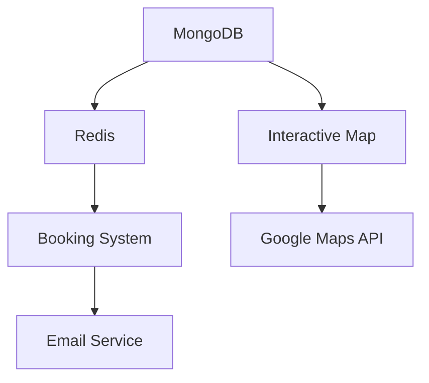

# Listing Page Implementation Plan

## Current Implementation Status (✅ Completed)

### Data Structure & Schema
- Implemented in `app/api/listings/mockData.ts`
- Includes all required fields:
  ```typescript
  interface Listing {
    id: string;
    title: string;
    price: number;
    bedrooms: number;
    // ...other fields
  }
  ```

### Components
1. **Listing Page** (`page.tsx`)
   - Server-side rendering
   - Error handling
   - Loading states

2. **Listing Client** (`listing-client.tsx`)
   - Image gallery
   - Contact form
   - Property details

3. **Property Card** (`property-card.tsx`)
   - Responsive design
   - Lazy loading

### API Endpoints
- `GET /api/listings/[id]`
- Mock data fallback
- JWT validation

---

## Remaining Implementation (🔲 Pending)

### Phase 1: Core Functionality (Week 1)
1. **MongoDB Setup**
   - Schema definition
   - Index creation (`listingId`, `location`, `price`)
   - Connection pooling

2. **Redis Caching**
   - Cache invalidation strategy
   - TTL configuration

3. **Inspection Booking**
   - Calendar UI
   - Time slot management
   - Email notifications

### Phase 2: UX Enhancements (Week 2)
1. **Interactive Map**
   - Google Maps integration
   - Property markers

2. **Form Validation**
   - Field validation
   - Error messages

3. **Social Sharing**
   - Meta tags
   - Share buttons

### Phase 3: Security & Testing (Week 3)
1. **Rate Limiting**
   - Redis-backed
   - Endpoint-specific

2. **CORS Policies**
   - Whitelisted domains

3. **Test Suite**
   - Unit tests (Jest)
   - E2E tests (Cypress)

---

## Technical Dependencies


## Risk Assessment
| Risk | Mitigation Strategy |
|------|---------------------|
| MongoDB performance | Implement proper indexing |
| API rate limits | Implement backoff retry |
| Map loading times | Lazy load components |

## Testing Strategy
1. **Unit Tests**
   - Core business logic
   - Utility functions

2. **Integration Tests**
   - API endpoints
   - Database operations

3. **E2E Tests**
   - User workflows
   - Critical paths
