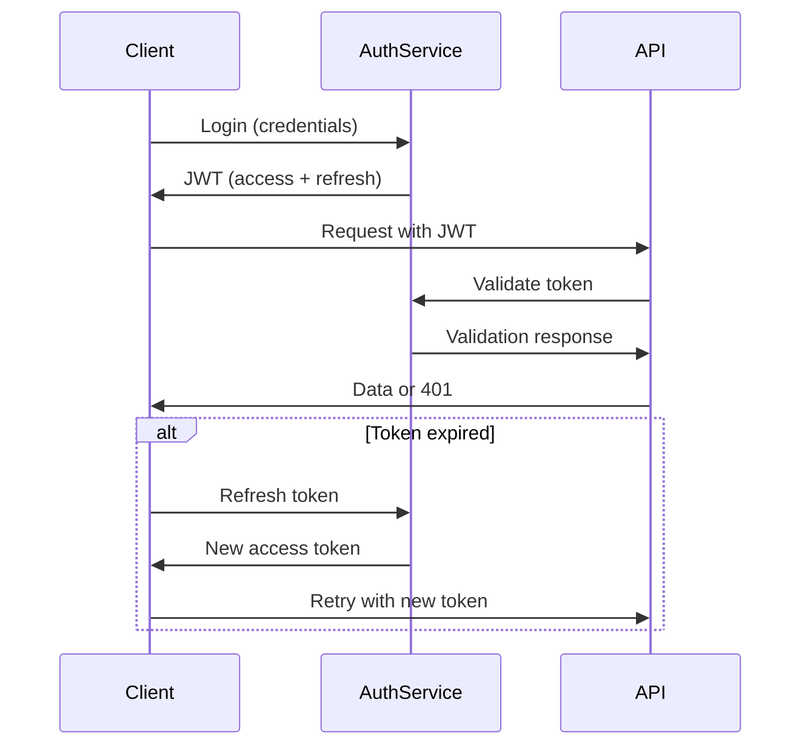

ad# Listing Page Implementation Guide

## Overview
This document details the comprehensive implementation of property listing pages, including:
- Data structure and schema definitions
- Component architecture and interactions
- API integration and authentication
- State management patterns
- Performance optimizations
- Security considerations
- Testing strategies

## Mock Data Structure
The mock data (`mockData.ts`) contains an array of property listings with the following structure:

```typescript
interface Listing {
  listingID: string;
  type: 'forSale' | 'forRent' | 'commercialSale' | 'commercialLease' | 'auction';
  address: {
    street: string;
    suburb: string;
    state: string;
    postcode: number;
  };
  heading: string;
  price: string;
  description: string;
  features: {
    indoor: string[];
    outdoor: string[];
    amenities: string[];
  };
  location: { lat: number; lng: number };
  virtualTour: string;
  socialMeta: {
    title: string;
    description: string;
    image: string;
  };
  bedBathCarLand: Array<{
    key: string;
    value: string;
  }>;
  images: Array<{
    url: string;
  }>;
  openForInspection?: Array<{
    date: string;
    time: string;
  }>;
  agents: Array<{
    agentID: number;
    name: string;
    title: string;
    phone: string;
    mobile: string;
    imageURL: string;
  }>;
}
```

## Key Components Architecture

### 1. Listing Page (`page.tsx`)
- **Route**: Dynamic route `/listings/[id]`
- **Responsibilities**:
  - Data fetching via `getServerSideProps`
  - Initial page layout rendering
  - Error boundary handling
- **State Management**:
  - Uses React Context for shared state
  - Implements loading skeletons
  - Error state handling with fallback UI

### 2. Listing Client Component (`listing-client.tsx`)
- **Interactive Elements**:
  - Image gallery with lazy loading
  - Contact agent form with validation
  - Inspection time selector with calendar integration
  - Interactive map with property markers
- **State Management**:
  - Uses Redux for complex state
  - Custom hooks for API interactions
  - Local state for UI interactions
- **Performance**:
  - Code splitting for heavy components
  - Memoization for expensive computations
  - Debounced event handlers

### 3. Property Card (`property-card.tsx`)
- **Reusability**:
  - Configurable via props
  - Theme-aware styling
  - Responsive breakpoints
- **Features**:
  - Optimized image loading
  - Price formatting utilities
  - Address formatting
  - Feature badges with icons
- **Performance**:
  - Pure component implementation
  - Memoized props
  - Intersection Observer for lazy loading

## API Integration Details

### Mock Data Endpoint
- **Path**: `/api/listings/[id]`
- **Response**:
  ```json
  {
    "data": Listing,
    "meta": {
      "timestamp": "ISO-8601",
      "cache": {
        "hit": boolean,
        "ttl": number
      }
    }
  }
  ```
- **Fallback**: Uses `mockData.ts` when API fails
- **Cache**: Implements Redis caching layer

### Real Data Flow
1. **Client Request**:
   - GET `/api/listings/[id]`
   - Includes auth token
   - Sets accept headers
2. **API Processing**:
   - Validates JWT token
   - Checks cache
   - Queries database if cache miss
3. **Response**:
   - Formats data according to schema
   - Adds metadata
   - Sets cache headers
4. **Client Handling**:
   - Parses response
   - Updates local state
   - Handles errors
   - Triggers side effects

## Data Flow Diagram

```mermaid
graph TD
    A[Client Request] --> B[/listings/[id]]
    B --> C{API Available?}
    C -->|Yes| D[Fetch from Database]
    C -->|No| E[Use Mock Data]
    D --> F[Return Listing Data]
    E --> F
    F --> G[Render Components]
```

## Advanced Implementation Details

### Image Gallery
- **Features**:
  - Swipe gestures for mobile
  - Keyboard navigation
  - Zoom functionality
  - Preloading of adjacent images
- **Performance**:
  - Progressive image loading
  - WebP format support
  - Responsive srcsets
- **Accessibility**:
  - ARIA labels
  - Keyboard controls
  - Screen reader support

### Inspection Times
- **Implementation**:
  - iCal export integration
  - Google Calendar integration
  - Timezone conversion
  - Recurring events support
- **UI**:
  - Interactive calendar widget
  - Time slot selection
  - Confirmation dialogs
- **State**:
  - Local state for selections
  - Global state for bookings
  - Validation rules

### Responsive Design
- **Breakpoints**:
  - Mobile (<768px)
  - Tablet (768-1024px)
  - Desktop (>1024px)
- **Techniques**:
  - CSS Grid layout
  - Flexbox fallbacks
  - Container queries
  - Viewport units
- **Optimizations**:
  - Critical CSS inlining
  - Font loading strategy
  - Resource hints

## Security Implementation

### Authentication Flow


### Token Management
1. **Storage**:
   - Access token: Memory only
   - Refresh token: HttpOnly cookie
   - Never in localStorage or cookies
2. **Security**:
   - RS256 algorithm
   - 15 minute access token expiry
   - 7 day refresh token expiry
   - Token rotation
   - IP binding
3. **Error Handling**:
   - Silent refresh for 401s
   - Exponential backoff
   - User notification on failure
   - Audit logging

### Rate Limiting
- 100 requests/minute per endpoint
- IP-based throttling
- Token-based quotas
- Circuit breaker pattern

## Comprehensive Testing Strategy

### Unit Tests
- Component rendering
- State transitions
- Utility functions
- Form validation

### Integration Tests
- API endpoints
- Data transformations
- Auth flows
- Component interactions

### E2E Tests
- User journeys
- Cross-browser testing
- Performance benchmarks
- Accessibility audits

### Test Cases
1. **Data Flow**:
   - API response handling
   - Error states
   - Loading states
   - Cache behavior

2. **UI/UX**:
   - Responsive layouts
   - Interactive elements
   - Form submissions
   - Navigation

3. **Security**:
   - Token expiration
   - Rate limiting
   - XSS protection
   - CSRF protection

4. **Performance**:
   - Lighthouse scores
   - Memory leaks
   - Render times
   - Network waterfalls
