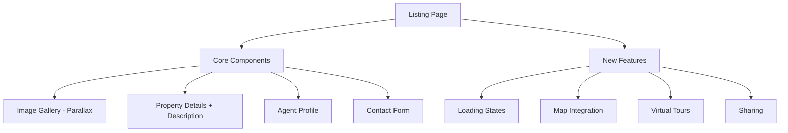

# Listing Page Enhancement Technical Specification

## Overview
**Purpose**: Enhance listing page functionality and UX  
**Current Status**: Basic implementation complete  
**Target Release**: v1.2.0  

## Feature Specifications

## Technical Details
### Component Architecture
- ListingClient (main container)
- ImageGallery (parallax + carousel)
- PropertyDetails (cards + full description)
- AgentProfile (with ratings)
- ContactForm (validated)
- MapEmbed (dynamic)
- ShareControls

### API Requirements
- GET /api/listings/[id] (existing)
- POST /api/contact (new)
- GET /api/map/embed (new)

### State Management
- Zustand for shared state
- React Query for data fetching
- Formik for form state

### Performance Considerations
- Image lazy loading
- Code splitting
- Memoization
- SSR for initial load

## Implementation Plan
| Phase | Features | Duration |
|-------|----------|----------|
| 1 | Loading states & form handling | 1 week |
| 2 | Map integration | 2 weeks |
| 3 | Virtual tours | 1 week |
| 4 | Sharing features | 1 week |

## Dependencies
- Map service API keys
- Virtual tour provider SDK
- Analytics integration
- Social sharing libraries

## Open Questions
1. Preferred map provider?
2. Virtual tour vendor selection?
3. Analytics requirements?
